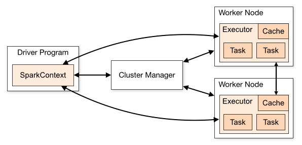

## Introdução ao Apache Spark

# 1. Introdução
Apache Spark é uma estrutura de computação em cluster de código aberto. Ele fornece APIs de desenvolvimento elegantes para Scala, Java, Python e R que permitem aos desenvolvedores executar uma variedade de cargas de trabalho intensivas de dados em diversas fontes de dados, incluindo HDFS, Cassandra, HBase, S3 etc.

Historicamente, o MapReduce do Hadoop provou ser ineficiente para alguns trabalhos de computação iterativos e interativos, o que acabou levando ao desenvolvimento do Spark. Com o Spark, podemos executar a lógica até duas ordens de magnitude mais rápido do que com o Hadoop na memória ou uma ordem de magnitude mais rápido no disco.

# 2. Arquitetura do Spark
Os aplicativos Spark são executados como conjuntos independentes de processos em um cluster, conforme descrito no diagrama abaixo:



Esse conjunto de processos é coordenado pelo objeto SparkContext em seu programa principal (chamado de programa driver). SparkContext se conecta a vários tipos de gerenciadores de cluster (seja o próprio gerenciador de cluster autônomo do Spark, Mesos ou YARN), que alocam recursos entre os aplicativos.

Uma vez conectado, o Spark adquire executores em nós no cluster, que são processos que executam cálculos e armazenam dados para seu aplicativo.

Em seguida, ele envia o código do seu aplicativo (definido pelos arquivos JAR ou Python passados para SparkContext) para os executores. Finalmente, SparkContext envia tarefas para os executores executarem.

# 3. Componentes principais
O diagrama a seguir fornece uma imagem clara dos diferentes componentes do Spark:


### 3.1. Spark Core

O componente Spark Core é responsável por todas as funcionalidades básicas de E / S, agendando e monitorando os trabalhos em clusters de faísca, despacho de tarefas, rede com diferentes sistemas de armazenamento, recuperação de falhas e gerenciamento de memória eficiente.

Ao contrário do Hadoop, o Spark evita que dados compartilhados sejam armazenados em armazenamentos intermediários, como Amazon S3 ou HDFS, usando uma estrutura de dados especial conhecida como RDD (Resilient Distributed Datasets).

Conjuntos de dados distribuídos resilientes são imutáveis, uma coleção particionada de registros que podem ser operados - em paralelo e permitem - cálculos "na memória" tolerantes a falhas.

Os RDDs suportam dois tipos de operações:

- Transformação - A transformação Spark RDD é uma função que produz um novo RDD a partir dos RDDs existentes. O transformador recebe RDD como entrada e produz um ou mais RDD como saída. As transformações são preguiçosas por natureza, ou seja, são executadas quando chamamos uma ação;
- Ação - as transformações criam RDDs umas das outras, mas quando queremos trabalhar com o conjunto de dados real, nesse ponto a ação é executada. Portanto, ações são operações Spark RDD que fornecem valores não RDD. Os valores de ação são armazenados nos drivers ou no sistema de armazenamento externo
Uma ação é uma das formas de enviar dados do Executor para o driver.

Executores são agentes responsáveis ​​pela execução de uma tarefa. Já o driver é um processo JVM que coordena os trabalhadores e a execução da tarefa. Algumas das ações do Spark são contar e coletar.

### 3.2. Spark SQL
Spark SQL é um módulo Spark para processamento de dados estruturados. É usado principalmente para executar consultas SQL. DataFrame constitui a abstração principal do Spark SQL. A coleta distribuída de dados ordenados em colunas nomeadas é conhecida como DataFrame no Spark.

O Spark SQL oferece suporte à busca de dados de diferentes fontes, como Hive, Avro, Parquet, ORC, JSON e JDBC. Ele também pode ser dimensionado para milhares de nós e consultas de várias horas usando o mecanismo Spark - que fornece tolerância total a falhas no meio da consulta.

### 3.3. Spark Streaming
O Spark Streaming é uma extensão do Spark API principal que permite o processamento escalonável, de alto rendimento e tolerante a falhas de fluxos de dados ao vivo. Os dados podem ser ingeridos de várias fontes, como Kafka, Flume, Kinesis ou soquetes TCP.

Finalmente, os dados processados ​​podem ser enviados para sistemas de arquivos, bancos de dados e painéis ativos.

### 3.4. Spark Mlib
MLlib é a biblioteca de aprendizado de máquina (ML) do Spark. Seu objetivo é tornar o aprendizado de máquina prático escalonável e fácil. Em um alto nível, ele fornece ferramentas como:

- Algoritmos de ML - algoritmos de aprendizagem comuns, como classificação, regressão, agrupamento e filtragem colaborativa;
- Featurização - extração, transformação, redução de dimensionalidade e seleção de características;
- Pipelines - ferramentas para construção, avaliação e ajuste de Pipelines de ML;
- Persistência - salvar e carregar algoritmos, modelos e pipelines;
- Utilitários - álgebra linear, estatísticas, tratamento de dados, etc.

### 3.5. Spark GraphX
GraphX ​​é um componente para gráficos e cálculos paralelos a gráficos. Em um alto nível, GraphX ​​estende o Spark RDD introduzindo uma nova abstração de Graph: um multigrafo direcionado com propriedades anexadas a cada vértice e aresta.

Para oferecer suporte à computação de gráfico, GraphX ​​expõe um conjunto de operadores fundamentais (por exemplo, subgraph, joinVertices e aggregateMessages).

Além disso, o GraphX ​​inclui uma coleção crescente de algoritmos e construtores de gráfico para simplificar as tarefas de analítica de gráfico.

# 4. “Hello World” no Spark
Agora que entendemos os componentes principais, podemos passar para um projeto simples do Spark baseado em Maven - para calcular contagens de palavras.

Estaremos demonstrando o Spark rodando no modo local, onde todos os componentes estão rodando localmente na mesma máquina onde está o nó mestre, nós do executor ou gerenciador de cluster autônomo do Spark.

### 4.1. Configuração Maven
Vamos configurar um projeto Java Maven com dependências relacionadas ao Spark no arquivo pom.xml:

```
<dependencies>
    <dependency>
        <groupId>org.apache.spark</groupId>
	<artifactId>spark-core_2.10</artifactId>
	<version>1.6.0</version>
    </dependency>
</dependencies>
```

### 4.2. Contagem de palavras - Spark Job
Agora vamos escrever o trabalho do Spark para processar um arquivo contendo frases e gerar palavras distintas e suas contagens no arquivo:

```
public static void main(String[] args) throws Exception {
    if (args.length < 1) {
        System.err.println("Usage: JavaWordCount <file>");
        System.exit(1);
    }
    SparkConf sparkConf = new SparkConf().setAppName("JavaWordCount");
    JavaSparkContext ctx = new JavaSparkContext(sparkConf);
    JavaRDD<String> lines = ctx.textFile(args[0], 1);

    JavaRDD<String> words 
      = lines.flatMap(s -> Arrays.asList(SPACE.split(s)).iterator());
    JavaPairRDD<String, Integer> ones 
      = words.mapToPair(word -> new Tuple2<>(word, 1));
    JavaPairRDD<String, Integer> counts 
      = ones.reduceByKey((Integer i1, Integer i2) -> i1 + i2);

    List<Tuple2<String, Integer>> output = counts.collect();
    for (Tuple2<?, ?> tuple : output) {
        System.out.println(tuple._1() + ": " + tuple._2());
    }
    ctx.stop();
}
```

Observe que passamos o caminho do arquivo de texto local como um argumento para um trabalho do Spark.

Um objeto SparkContext é o principal ponto de entrada para Spark e representa a conexão com um cluster Spark já em execução. Ele usa o objeto SparkConf para descrever a configuração do aplicativo. SparkContext é usado para ler um arquivo de texto na memória como um objeto JavaRDD.

Em seguida, transformamos as linhas do objeto JavaRDD em palavras do objeto JavaRDD usando o método flatmap para primeiro converter cada linha em palavras separadas por espaço e, em seguida, achatar a saída de cada processamento de linha.

Novamente aplicamos a operação de transformação mapToPair, que basicamente mapeia cada ocorrência da palavra para a tupla de palavras e contagem de 1.

Em seguida, aplicamos a operação reduceByKey para agrupar várias ocorrências de qualquer palavra com contagem 1 a uma tupla de palavras e somamos a contagem.

Por último, executamos a ação collect RDD para obter os resultados finais.

### 4.3. Executando - Trabalho do Spark
Vamos agora construir o projeto usando Maven para gerar apache-spark-1.0-SNAPSHOT.jar na pasta de destino.

Em seguida, precisamos enviar este trabalho WordCount para o Spark:

```
${spark-install-dir}/bin/spark-submit --class com.isaccanedo.WordCount 
  --master local ${WordCount-MavenProject}/target/apache-spark-1.0-SNAPSHOT.jar
  ${WordCount-MavenProject}/src/main/resources/spark_example.txt
```

No envio, algumas etapas acontecem nos bastidores:

- A partir do código do driver, SparkContext se conecta ao gerenciador de cluster (em nosso caso, o gerenciador de cluster autônomo é executado localmente);
- O Cluster Manager aloca recursos em outros aplicativos
- Spark adquire executores em nós do cluster. Aqui, nosso aplicativo de contagem de palavras obterá seus próprios processos executores;
- O código do aplicativo (arquivos jar) é enviado aos executores
- As tarefas são enviadas pelo SparkContext para os executores.

Finalmente, o resultado do trabalho spark é retornado ao driver e veremos a contagem de palavras no arquivo como saída:

```
Hello 1
from 2
Baledung 2
Keep 1
Learning 1
Spark 1
Bye 1
```

# 5. Conclusão
Neste artigo, discutimos a arquitetura e os diferentes componentes do Apache Spark. Também demonstramos um exemplo de trabalho de um trabalho do Spark fornecendo contagens de palavras de um arquivo.